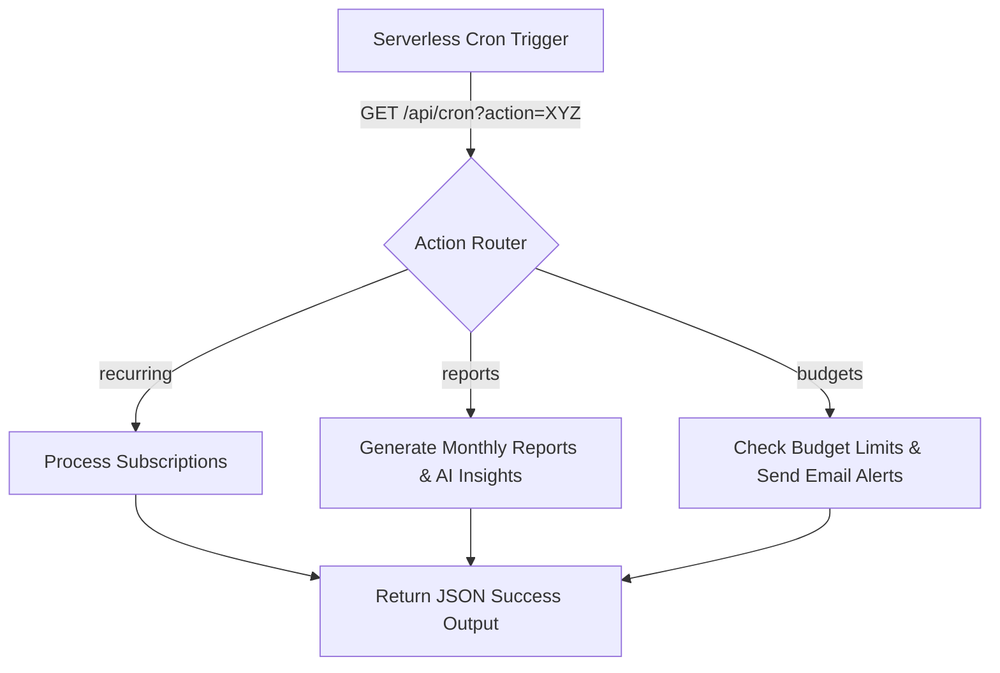

# Welth: Technical Architecture & Core App Flow Guide

Welcome to the Technical Architecture Guide for the **Welth** personal finance management application. This document details how each core feature is built, why specific architectural choices were made, and traces the step-by-step "story" of user interactions—from clicking buttons to executing database transactions and serverless AI tasks.

---

## Table of Contents

1. [OAuth Authentication Flow (Auth.js)](#1-oauth-authentication-flow-authjs)
2. [Sandbox Demo Seeding Flow](#2-sandbox-demo-seeding-flow)
3. [Gemini AI OCR Receipt Scanner Flow](#3-gemini-ai-ocr-receipt-scanner-flow)
4. [PostgreSQL-Backed Rate Limiting](#4-postgresql-backed-rate-limiting)
5. [Serverless Cron Jobs (Automations)](#5-serverless-cron-jobs-automations)
6. [Interactive Dashboard & Charts](#6-interactive-dashboard--charts)
7. [Interactive Debt Settlement Graph](#7-interactive-debt-settlement-graph)
8. [Client-Side PDF Statement Generator](#8-client-side-pdf-statement-generator)
9. [Gemini Function-Calling AI Financial Advisor](#9-gemini-function-calling-ai-financial-advisor)

---

## 1. OAuth Authentication Flow (Auth.js)

### Why We Use It

Instead of forcing users to register with passwords, verify emails, or reset credentials, the app uses **Auth.js** (NextAuth v5) to support single-click OAuth login via Google and GitHub. This ensures high security, zero friction, and lets us leverage verified email profiles.

### The Authentication "Story" (Step-by-Step Flow)

1. **User Clicks Log In**: The user clicks the Login button on the landing page, navigating to `/login`.
2. **Selects Provider**: The user clicks Google or GitHub. NextAuth initiates a secure OAuth redirect to the provider's server.
3. **User Approves**: The user logs in on the provider's window and approves access.
4. **OAuth Callback**: The provider sends a callback payload with token details back to the Next.js API route (`/api/auth/[...nextauth]`).
5. **Database User Sync (`signIn` callback)**:
   - NextAuth triggers the `signIn` callback.
   - The server intercepts this event and checks if a user record exists in our PostgreSQL database using Prisma.
   - If the user is logging in for the first time, a new `User` record is created in the database, mapping their email, name, and profile image.
6. **JWT Generation (`jwt` callback)**:
   - NextAuth compiles the JWT.
   - The `jwt` callback runs, fetching the auto-generated database `id` for this user and embedding it as `token.userId` inside the secure cookie.
7. **Session Distribution (`session` callback)**:
   - When client or server components call `auth()`, the `session` callback runs, reading `token.userId` and assigning it to `session.user.id` so it is easily accessible.

### Core Implementation

_Configured in [auth.js](file:///e:/NextJs/finance-manage/auth.js):_

```javascript
import NextAuth from "next-auth";
import Google from "next-auth/providers/google";
import GitHub from "next-auth/providers/github";
import { db } from "@/lib/prisma";

export const { handlers, auth, signIn, signOut } = NextAuth({
  providers: [
    Google({
      clientId: process.env.AUTH_GOOGLE_ID,
      clientSecret: process.env.AUTH_GOOGLE_SECRET,
    }),
    GitHub({
      clientId: process.env.AUTH_GITHUB_ID,
      clientSecret: process.env.AUTH_GITHUB_SECRET,
    }),
  ],
  session: {
    strategy: "jwt",
  },
  callbacks: {
    async signIn({ user }) {
      if (!user.email) return false;
      try {
        // Sync user with our database
        const existingUser = await db.user.findUnique({
          where: { email: user.email },
        });

        if (!existingUser) {
          await db.user.create({
            data: {
              email: user.email,
              name: user.name || "User",
              imageUrl: user.image || "",
            },
          });
        }
        return true;
      } catch (error) {
        console.error("Error syncing user during sign in:", error);
        return false;
      }
    },
    async jwt({ token, user }) {
      if (user) {
        try {
          const dbUser = await db.user.findUnique({
            where: { email: user.email },
            select: { id: true },
          });
          if (dbUser) {
            token.userId = dbUser.id;
          }
        } catch (error) {
          console.error("Error fetching user ID for JWT:", error);
        }
      }
      return token;
    },
    async session({ session, token }) {
      if (session.user && token.userId) {
        session.user.id = token.userId;
      }
      return session;
    },
  },
  pages: {
    signIn: "/login",
  },
});
```

---

## 2. Sandbox Demo Seeding Flow

### Why We Use It

When a recruiter or new user logs in for the first time, their dashboard is empty. A blank dashboard is hard to evaluate. The Seeding flow allows users to populate their workspace with 90 days of realistic, randomized transactions, pre-set budgets, and simulated Splitwise groups in **10 seconds**, avoiding tedious manual input.

### The Seeding "Story"

1. **First Log In**: User enters the dashboard `/dashboard`. The server checks the database for any accounts associated with the logged-in user ID.
2. **Onboarding Screen**: Since the user has 0 accounts, the dashboard redirects the view to show the setup options (Option A: "Explore with Demo Data" or Option B: "Start Clean").
3. **Trigger Seeding**: The user clicks **Load Demo Data**. This fires the `seedTransactions` server action.
4. **Authenticating Connection**: The seeder authenticates the session to find the user's email.
5. **Account Creation**: The database checks if a default account exists. If not, it creates a new "Main Checking" account with a starting balance of `$0.00`.
6. **Generating Dynamic Dummy Data**:
   - A helper loops over 3 consecutive 30-day blocks (spanning 90 days).
   - Inside each block, it dynamically seeds salary payments, utility bills, multiple grocery purchases, Uber rides, restaurant visits, and trips.
   - **Crucial Detail**: To make the data realistic, transaction amounts and dates are randomized for each user run using `Math.random()`.
7. **Upsert Budget**: It upserts a default monthly budget limit of `$4,000` connected to their profile.
8. **Seed Splitwise Group**:
   - It creates a "Friends (Demo)" group.
   - Creates two guest members: "Alice" and "Bob".
   - Creates two shared expenses (Rent and Groceries) split equally, logging the calculated shares to the database.
9. **Atomic database transaction**:
   - The server runs a Prisma `$transaction`.
   - Clears out any older seeded data for the user.
   - Inserts the 90 days of transactions in a single database execution block.
   - Updates the final account balance to reflect the net sum.
10. **Revalidation**: The server revalidates paths (`/dashboard`) and reloads the page. The dashboard now shows beautiful graphs and budget progress!

---

## 3. Gemini AI OCR Receipt Scanner Flow

### Why We Use It

Manually entering transaction descriptions, categories, dates, and amounts is the biggest friction point in budgeting. This feature lets users snap a photo of a receipt or drop an image file, using AI to extract all variables instantly.

### The Scanner "Story"

1. **User Drops File**: The user drags/selects a receipt image (PNG/JPG/SVG) on the scanner panel in the transaction form.
2. **Trigger Scan**: The client calls the `scanReceipt(file)` server action, passing the raw file object.
3. **Convert Image to Base64**: The server reads the file's ArrayBuffer and converts it to a standard base64 string, preparing it for the generative model.
4. **Instantiate Gemini AI**: The server initializes the Google Generative AI client using the `gemini-2.5-flash` model.
5. **Prompt with Strict Schema Constraints**:
   - The image and a strict text prompt are passed to Gemini.
   - The prompt instructs Gemini to output **ONLY valid JSON** conforming to this exact structure:
     `{ "amount": number, "date": "ISO date string", "description": "string", "merchantName": "string", "category": "string" }`
   - It also forces the output category to match one of our database-supported enum keys.
6. **Parse AI Response**:
   - The server receives the raw text response from Gemini.
   - It strips away markdown block wrappers (e.g. ` ```json `).
   - Runs `JSON.parse` to convert the string to a javascript object.
7. **Auto-Fill Form Fields**:
   - The parsed object is sent back to the client form.
   - The form updates its inputs dynamically.
   - A glowing **`✨ AI Auto-filled`** badge appears next to the populated inputs (Amount, Category, Date, Merchant) so the user knows exactly which fields the AI handled.
8. **Review & Save**: The user reviews the details, selects their account, and clicks "Create Transaction" to write it to the database.

### Core Implementation

_Configured in [actions/transaction.js](file:///e:/NextJs/finance-manage/actions/transaction.js#L217-L284):_

````javascript
export async function scanReceipt(file) {
  try {
    // Custom rate limiting check
    const ip = (await headers()).get("x-forwarded-for") || "127.0.0.1";
    const limitResult = await rateLimit(ip, "scan-receipt", 5, 600000);
    if (!limitResult.success) {
      throw new Error("Rate limit exceeded. Please wait.");
    }

    const model = genAI.getGenerativeModel({ model: "gemini-2.5-flash" });

    // Convert file to Base64
    const arrayBuffer = await file.arrayBuffer();
    const base64String = Buffer.from(arrayBuffer).toString("base64");

    const prompt = `
      Analyze this receipt image and extract the following information in JSON format:
      - Total amount (just the number)
      - Date (in ISO format)
      - Description or items purchased (brief summary)
      - Merchant/store name
      - Suggested category (one of: housing, transportation, groceries, utilities, entertainment, food, shopping, healthcare, education, personal, travel, insurance, gifts, bills, other-expense)
      
      Only respond with valid JSON in this exact format:
      {
        "amount": number,
        "date": "ISO date string",
        "description": "string",
        "merchantName": "string",
        "category": "string"
      }
    `;

    const result = await model.generateContent([
      {
        inlineData: {
          data: base64String,
          mimeType: file.type,
        },
      },
      prompt,
    ]);

    const response = await result.response;
    const text = response.text();
    const cleanedText = text.replace(/```(?:json)?\n?/g, "").trim();

    const data = JSON.parse(cleanedText);
    return {
      amount: parseFloat(data.amount),
      date: new Date(data.date),
      description: data.description,
      category: data.category,
      merchantName: data.merchantName,
    };
  } catch (error) {
    console.error("Error scanning receipt:", error);
    throw new Error("Failed to scan receipt");
  }
}
````

---

## 4. PostgreSQL-Backed Rate Limiting

### Why We Use It

Google Gemini API calls are highly computationally expensive and incur costs. To prevent malicious users or bots from hitting our AI endpoints in loop (API Key abuse), we built a custom, self-cleaning rate limiter backed by our PostgreSQL database.

### The Rate Limiting "Story"

1. **Identify Client**: The server extracts the client's IP address from headers (`x-forwarded-for`).
2. **Clean Historical Logs**: The rate limiter executes a self-pruning query, deleting any rate limit logs that are older than our time window (e.g., older than 10 minutes).
3. **Count Hits**: It queries the `RateLimit` table to count how many records match this IP and the action `scan-receipt` within the active time window.
4. **Exceeded Block**: If the count is equal to or greater than the limit (e.g., 5 requests per 10 minutes), the server throws an error: `"Rate limit exceeded. Please wait a few minutes before scanning another receipt."`
5. **Successful Log**: If the limit is not reached, the server creates a new log record matching the IP, action, and timestamp, allowing the AI process to proceed.
6. **Fail-Open Fallback**: If the database connection times out or fails during the rate limit check, the query fails open. This ensures we never block genuine users if our logging table has a connection issue.

### Core Implementation

_Configured in [lib/rate-limit.js](file:///e:/NextJs/finance-manage/lib/rate-limit.js):_

```javascript
import { db } from "@/lib/prisma";

export async function rateLimit(ip, route, limit = 10, windowMs = 60000) {
  const now = new Date();
  const windowStart = new Date(now.getTime() - windowMs);

  try {
    // 1. Prune expired entries to keep the table clean
    await db.rateLimit.deleteMany({
      where: {
        timestamp: {
          lt: windowStart,
        },
      },
    });

    // 2. Count active requests in the current window
    const requestCount = await db.rateLimit.count({
      where: {
        ip,
        route,
        timestamp: {
          gte: windowStart,
        },
      },
    });

    if (requestCount >= limit) {
      return { success: false, limit, remaining: 0 };
    }

    // 3. Log this request
    await db.rateLimit.create({
      data: {
        ip,
        route,
        timestamp: now,
      },
    });

    return { success: true, limit, remaining: limit - requestCount - 1 };
  } catch (error) {
    console.error("Rate limit check failed:", error);
    // Fail open in case of DB issues to avoid blocking users
    return { success: true, limit, remaining: 1 };
  }
}
```

---

## 5. Serverless Cron Jobs (Automations)

### Why We Use It

For financial tracking to be fully automated, recurring actions (like subscription billings, monthly reporting, and budget threshold checks) must run in the background. The app exposes a secure API endpoint `/api/cron` that serverless triggers can ping daily.

### The Cron Jobs "Story"



#### A. Recurring Transactions (Subscriptions)

- **What it does**: Automatically duplicates transactions that are set on a repeating schedule (e.g. daily, weekly, monthly, yearly) once their due date is reached.
- **The Flow**:
  1. Finds all transactions in the database where `isRecurring: true`, `status: "COMPLETED"`, and the `nextRecurringDate` is less than or equal to the current time.
  2. Loops over each due transaction inside a database `$transaction` to process atomically:
     - Creates a new transaction duplicate representing this month's payment (setting `isRecurring: false` on the new record).
     - Automatically updates the associated account balance (e.g., decrementing for Netflix subscriptions).
     - Calculates the new `nextRecurringDate` based on the interval pattern and updates the original subscription record with a fresh `lastProcessed` timestamp.

#### B. Budget Alerts

- **What it does**: Monitors spending and warns users before they run out of money.
- **The Flow**:
  1. Fetches all budget limits set by users.
  2. Queries the sum of all expenses logged on the user's default checking account since the 1st of the current month.
  3. Calculates the utilization percentage: `(Expenses / Budget Limit) * 100`.
  4. If the percentage is **$\ge$ 80%** and no alert email was sent yet this month:
     - Sends an email warning utilizing **Resend** and a React email template.
     - Updates `lastAlertSent` to the current timestamp to prevent duplicate notifications.

#### C. Monthly Reports (with AI Financial Insights)

- **What it does**: Provides a monthly digest summarizing incomes and expenses, enriched with custom AI-written financial tips.
- **The Flow**:
  1. Loops over all active users in the database.
  2. Aggregates their total income and expenses for the previous month, grouping transactions by category.
  3. Formulates a text prompt summarizing these stats and queries Google Gemini:
     - Prompt: _"Analyze this financial data... Total Income: $X, Total Expenses: $Y... Category breakdowns... Provide 3 concise, friendly, conversational and actionable insights in a JSON array."_
  4. Parses the AI insights array and sends the user a comprehensive HTML email report.

---

## 6. Interactive Dashboard & Charts

### Why We Use It

Visual charts are crucial for understanding spending trends. We use **Recharts** wrapped in responsive grids to display income vs. expense breakdowns in real-time.

### The Chart "Story"

1. **Data Load**: Next.js fetches user account balances and transactions on the server and loads them into the layout.
2. **Recharts Rendering**:
   - **AreaChart**: Maps the running total of expenses across monthly blocks, applying smooth linear gradients to fill under the curve.
   - **PieChart**: Groups the transactions by category, styling segments with an aesthetic, modern palette (`indigo`, `emerald`, `amber`, `rose`, `purple`).
3. **Simulated State (Playground)**:
   - In `/playground`, the Recharts component binds directly to a React state `chartData`.
   - When users click **Save Transaction (Demo)** in the AI OCR auto-fill form preview:
     - The React state updates: `Expenses` for the current month increments by the receipt total.
     - The AreaChart detects this state change and smoothly animates the line upwards to show the added expense.

---

## 7. Interactive Debt Settlement Graph

### Why We Use It

Rather than just showing lists of text balances, a visual flow makes complex peer debts clear immediately. We designed a lightweight, interactive SVG network graph component that brings our greedy debt-minimization algorithm outputs to life without heavy external canvas dependencies.

### The Graph Flow "Story"

1. **Calculate Settlements**: When the user opens the group details page, the server runs `calculateGroupBalances`, applying a greedy minimization logic that matches the highest debtors to the highest creditors, reducing the transaction footprint.
2. **Retrieve Coordinates**: On the client side, the visualizer maps the unique members in a circle. It automatically calculates the coordinate angle $\theta_i$ for each node:
   - $X_i = CX + R \cdot \cos(\theta_i)$
   - $Y_i = CY + R \cdot \sin(\theta_i)$
3. **Draw Arcs (Directed Edges)**: The SVG draws curved paths using quadratic bezier formulas:
   - `M x1 y1 Q qx qy x2 y2`
   - Arrowheads are anchored on node borders using SVG `<marker>` tags.
4. **Animate Cash Flow**: Small glowing SVG circles (`animateMotion`) loop along the bezier paths in the direction of the payments to represent the transaction stream.
5. **Interactive Highlight**: Hovering over a node dims all other members and paths, emphasizing only the incoming/outgoing streams for that person. Tooltips display detailed values on hover.

---

## 8. Client-Side PDF Statement Generator

### Why We Use It

Mimicking actual banking and accounting suites, users need a way to export physical bank statements of their personal transactions and group settlement invoices. We use `jspdf` and `jspdf-autotable` to generate professional documents directly in the client browser.

### The Exporter "Story"

1. **User Triggers Export**: In the accounts page (under the filter bar) or the group details page, the user clicks the **Export** dropdown and selects "Export as PDF Statement".
2. **Collect and Summarize Data**:
   - **Personal Account**: The system reads the active filtered transactions and aggregates total income, total expenses, and net savings.
   - **Shared Group**: The system maps the net balances of each member and compiles the minimized settlement steps.
3. **Design Layout Grid**:
   - Generates a styled header banner with purple branding (`#9333ea`).
   - Draws a "Summary of Period" container with colored values.
   - Triggers `doc.autoTable` to construct a clean tabular grid with alternating light-purple rows, page numbering, and color-coded green (income) vs red (expenses) transaction types.
4. **Save File**: The generated PDF binary is compiled and downloaded instantly via the browser's download manager.

---

## 9. Gemini Function-Calling AI Financial Advisor

### Why We Use It

AI applications in 2026 demand context-aware capabilities. Rather than building static question-answer interfaces, we built a sidebar assistant powered by Google Gemini that safely and dynamically executes local database tools to answer specific queries about the user's accounts, budgets, and group splits.

### The AI Agent "Story"

1. **User Sends Query**: The user asks: *"Am I on track to meet my budget this month?"* in the sidebar assistant.
2. **Analyze Intent (Gemini Route)**: The server API handler receives the message list and starts a chat session (`model.startChat`) loaded with a list of system tools:
   - `getUserAccountOverview()`
   - `getUserRecentTransactions(limit, category, startDate, endDate)`
   - `getUserBudgetsAndSpending()`
   - `getGroupSettlementReport(groupId)`
3. **Identify Tool Requirement**: Gemini analyzes the user's message, identifies that it needs specific database parameters, and responds to the server with a request to execute `getUserBudgetsAndSpending()`.
4. **Local Secure Execution**: The server intercepts the tool call, fetches the session user's ID via NextAuth `auth()`, and executes the query strictly scoped to that ID (`userId: user.id`).
5. **Formulate Final Response**: The server sends the query results back to Gemini. Gemini digests the numbers and replies to the user in natural language: *"You have spent $450 of your $1,200 budget. You are on track!"*
